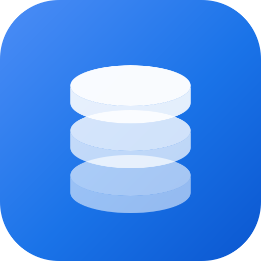
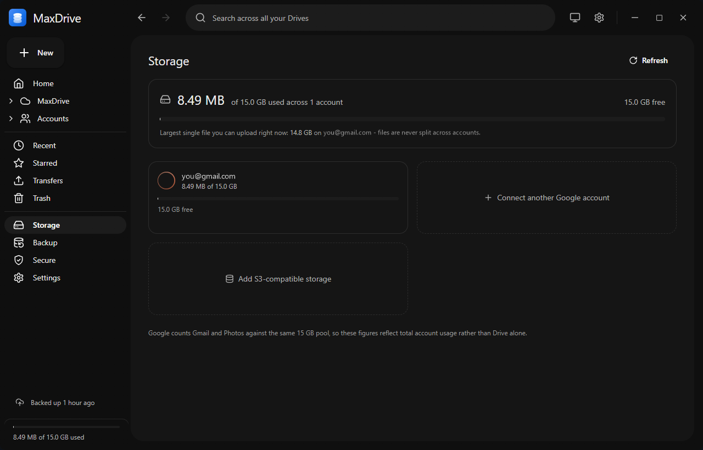
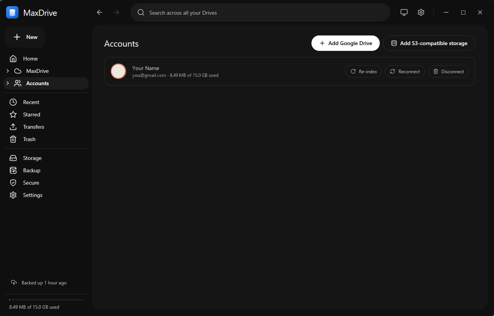
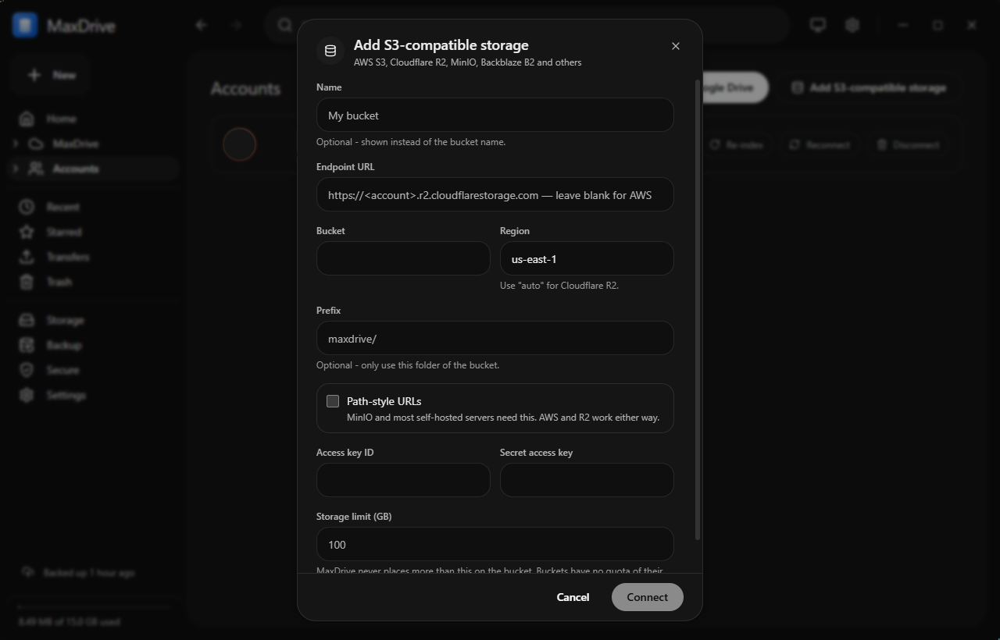
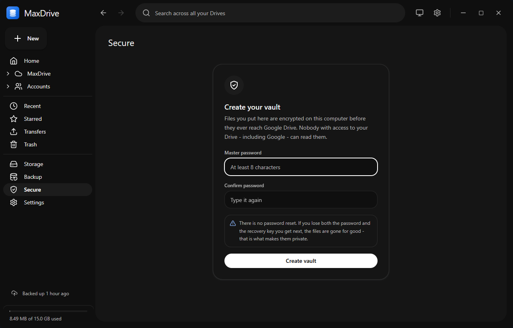
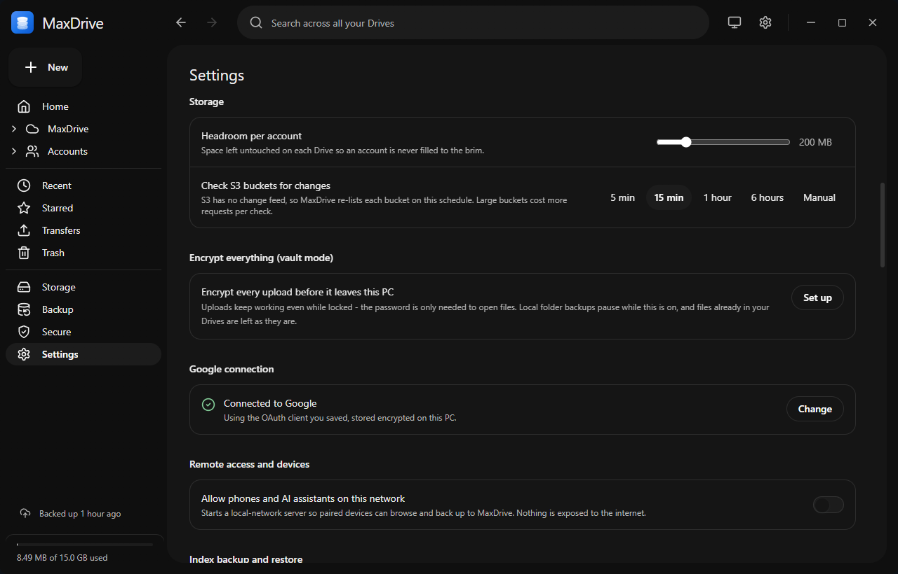
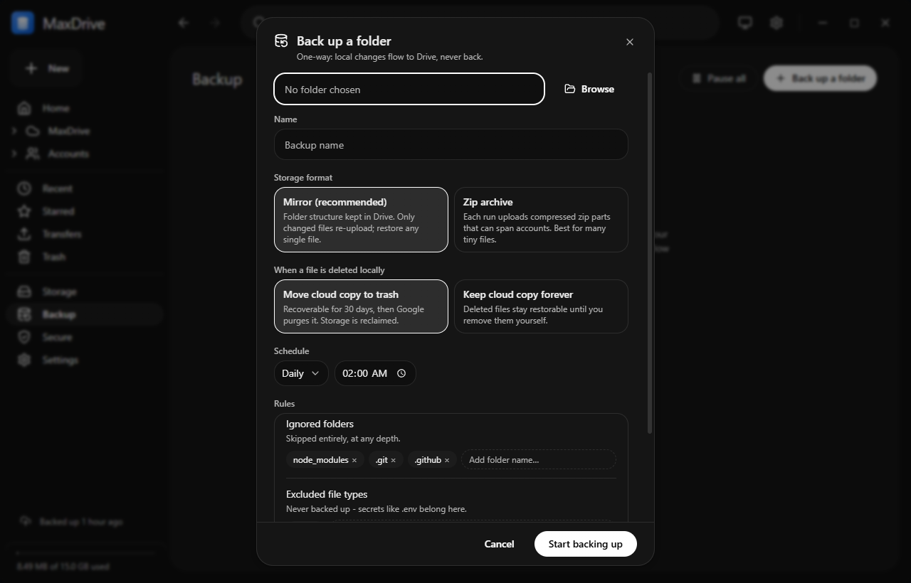
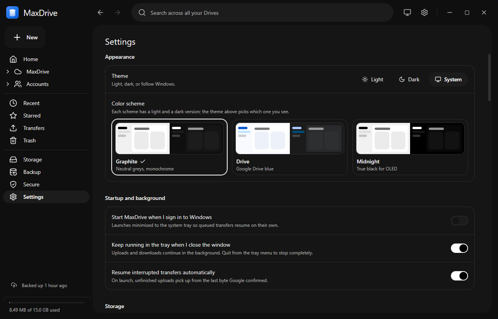

<div align="center">



# MaxDrive

**Secure storage for Windows.** Pool any number of Google Drive accounts and
S3-compatible buckets into one encrypted drive - with a built-in MCP server and
device pairing, so AI assistants and your phone can use it too.

[](https://github.com/nettanvirdev/maxdrive/actions/workflows/ci.yml)
[](https://github.com/nettanvirdev/maxdrive/releases)
[](LICENSE)


[Download](#download) · [Getting started](docs/getting-started.md) · [Documentation](docs/README.md) · [Build from source](#build-from-source) · [Contributing](CONTRIBUTING.md)



</div>

---

## Why MaxDrive

You have a handful of Gmail accounts with 15 GB each, maybe a cheap S3 bucket,
and no sensible way to use them together - let alone privately. MaxDrive turns
them into **one drive**: one file tree, one search, and uploads that land
wherever there is room. Anything sensitive is encrypted on your PC before it
leaves, so the storage providers only ever see ciphertext.

## Features

### Secure by design

- **Secure Storage vault** - an end-to-end encrypted area (AES-256-GCM, scrypt
  password, one-time recovery key). Files and names are encrypted before upload
  and can be replicated across several accounts.
- **Vault mode** - one switch that encrypts *every* new upload and folder, with
  its own password. Uploads keep working while it's locked (public-key
  sealing); unlocking reveals names and allows preview and download.
- **Your keys stay local** - OAuth tokens, S3 keys and your Google client are
  encrypted with Windows DPAPI; keys never leave the main process.
- **No middleman** - there is no MaxDrive server. The app talks straight to
  Google and your S3 endpoint using your own credentials.

### Many accounts, one drive

- **Multiple Google accounts** - connect as many Gmail / Google Drive accounts
  as you like, each with its own quota.
- **Any S3-compatible storage** - AWS S3, Cloudflare R2, Backblaze B2, Wasabi,
  MinIO and friends, each with a storage limit you choose.
- **Automatic placement** - uploads go to whichever account has room, with a
  configurable headroom reserve; moves between accounts migrate the bytes.
- **Fast local index** - browsing and search are instant and work offline;
  Google's change feed keeps it current, and the index is backed up to your
  Drives so a reinstall loses nothing.
- **Resumable transfers** - uploads and downloads survive crashes, reboots,
  sleep and dropped connections.
- **Local folder backup** - mirror or snapshot-archive backups of folders on
  your PC to Google Drive, on a schedule.

### AI ready

- **Built-in MCP server** - generate a connection command in Settings and your
  AI assistant (Claude Code or any MCP client) can browse, search, upload and
  organise your files. A stdio bridge and an Agent Skill ship in
  [`skills/`](skills/README.md).
- **Mobile-ready API** - opt-in LAN API with QR + 6-digit device pairing,
  instant revocation and per-device secrets. Phones and other devices can pair
  and connect; the REST and protocol references are in
  [`skills/maxdrive/references/`](skills/maxdrive/references/).

### Nice to use

- Light and dark themes with three colour schemes, command palette, full
  keyboard shortcuts, in-app preview for images, video, audio, PDF and text,
  sharing links, tray mode and start-on-sign-in.

See the complete list in [docs/FEATURES.md](docs/FEATURES.md).

## Screenshots

| | |
| :---: | :---: |
| <br />**Google Drive and S3 accounts side by side** | <br />**Any S3-compatible bucket, with your own limit** |
| <br />**Secure Storage: an end-to-end encrypted vault** | <br />**Vault mode encrypts every upload** |
| <br />**Scheduled local folder backups** | <br />**Light and dark, three color schemes** |

## Download

Grab the latest build from
[Releases](https://github.com/nettanvirdev/maxdrive/releases):

| File                          | What it is                                  |
| ----------------------------- | ------------------------------------------- |
| `MaxDrive-Setup-<version>.exe`    | Installer (per-user, choose install folder) |
| `MaxDrive-<version>-Portable.exe` | Single portable executable, no install      |

Builds are not code-signed yet, so Windows SmartScreen may warn on first run -
choose **More info → Run anyway**.

Then follow [Getting started](docs/getting-started.md). Using Google Drive
needs a free Google Cloud OAuth client of your own (about 10 minutes,
[step by step](docs/guides/google-cloud-setup.md)); S3 storage needs only your
bucket's keys.

## Build from source

### Prerequisites

- Windows 10 or 11 (x64)
- [Bun](https://bun.sh) 1.2 or newer (package manager and script runner)
- [Node.js](https://nodejs.org) 20 or newer (used by Electron's build tooling)
- Git

### Run in development

```bash
git clone https://github.com/nettanvirdev/maxdrive.git
```

```bash
cd maxdrive
```

```bash
bun install
```

```bash
bun run dev
```

`bun run dev` starts Vite on port 5173 and Electron together, with hot reload
for the UI. Paste your Google OAuth client into **Settings → Google
connection**, or put it in a `.env` file (copy [`.env.example`](.env.example))
while developing.

### Build the installers

```bash
bun run dist
```

This builds the renderer and writes `MaxDrive-Setup-<version>.exe` and
`MaxDrive-<version>-Portable.exe` to `release/`. `bun run pack` produces an
unpacked app in `release/win-unpacked/` for quick testing.

### Scripts

| Command              | Purpose                                              |
| -------------------- | ---------------------------------------------------- |
| `bun run dev`        | Vite dev server + Electron, hot reload               |
| `bun run test`       | Run the Vitest suite                                 |
| `bun run test:watch` | Vitest in watch mode                                 |
| `bun run build`      | Build the renderer into `dist/`                      |
| `bun run pack`       | Unpacked app in `release/win-unpacked/`              |
| `bun run dist`       | Setup + portable executables in `release/`           |
| `bun run icons`      | Re-render the app icon from `public/assets/logo.svg` |

## Development

MaxDrive is an Electron app: a plain-CommonJS main process that owns every
network, database and filesystem call, and a React 18 + Vite + Tailwind
renderer that talks to it only through a typed IPC bridge.

```
src/main/          Electron main process (.cjs)
  auth/            OAuth (PKCE loopback), DPAPI-encrypted token store
  db/              better-sqlite3 index, migrations, queries
  drive/  s3/      Google Drive and S3 (hand-rolled SigV4) clients
  providers/       storage-provider seam the rest of the app talks to
  sync/            scanner, change poller, cloud index backup
  transfers/       persistent, resumable transfer queue
  vault/           Secure Storage and vault-mode cryptography
  localBackup/     local folder backup engine and scheduler
  server/          opt-in LAN API, device pairing, MCP endpoint
src/renderer/      React UI: pages, components, Zustand stores, commands
tests/             Vitest unit tests
skills/            MCP bridge, Agent Skill and API references for clients
docs/              user guides and developer documentation
```

Start with [docs/development.md](docs/development.md), then
[docs/CODEBASE.md](docs/CODEBASE.md) (file-by-file map, IPC contract, schema)
and [docs/ARCHITECTURE.md](docs/ARCHITECTURE.md) (invariants and edge cases).

## Where your data lives

- **On this PC:** `%APPDATA%\maxdrive\` - the SQLite index, encrypted tokens and
  credentials, thumbnail cache and logs.
- **In each Google account:** a `MaxDrive/` folder with your files, plus hidden
  `.index/`, `.vault/` and `.backup/` areas.
- **In each S3 bucket:** everything under the prefix you chose is shown;
  files MaxDrive uploads go into a `MaxDrive/` folder there.

Losing the local database is never data loss: files stay in your storage, and
the index rebuilds from a scan or a cloud snapshot. See
[Index backup and recovery](docs/guides/index-backup-and-recovery.md).

## Contributing

Bug reports, ideas and pull requests are welcome - please read
[CONTRIBUTING.md](CONTRIBUTING.md) and the
[Code of Conduct](CODE_OF_CONDUCT.md) first. Found a security issue? Please
follow [SECURITY.md](SECURITY.md) instead of opening a public issue.

## License

[MIT](LICENSE) © Tanvir Ahamed

MaxDrive is an independent project and is not affiliated with or endorsed by
Google or Amazon. Google Drive is a trademark of Google LLC; Amazon S3 is a
trademark of Amazon.com, Inc.
