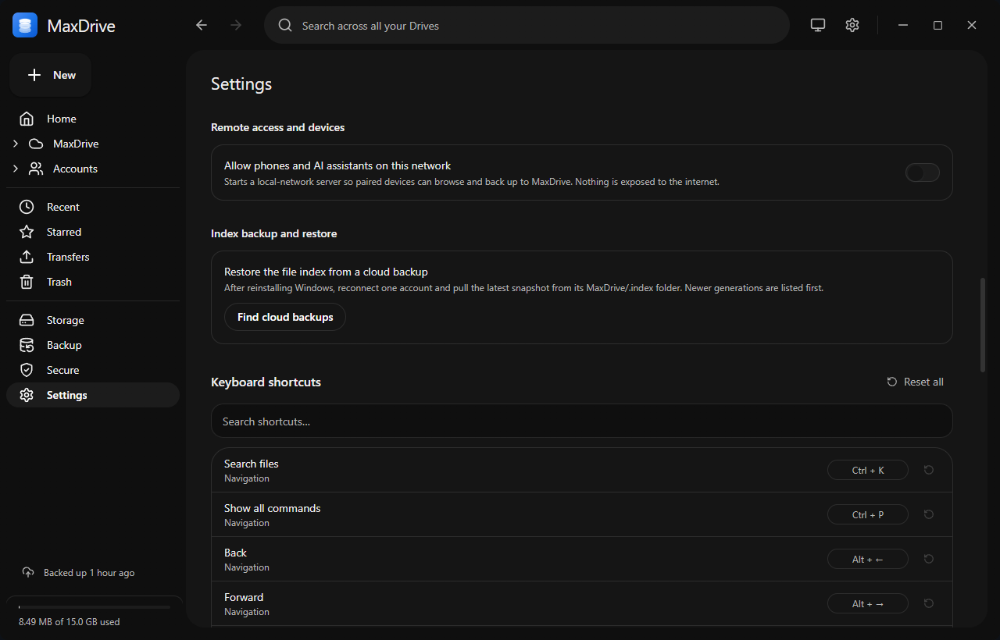

# Remote access and AI assistants

MaxDrive can run a small server on your local network so paired phones, tools and AI assistants can browse, search and manage your pooled storage. It is off by default, and every device must be paired and approved on the PC before it gets in.

## What you get

- **Device pairing** with a 6-digit code or QR code, approved on the PC.
- **A built-in MCP server**, so Claude and other MCP clients can work with your files.
- **A mobile-ready REST API** with live WebSocket events, for building your own phone or web client.

No official MaxDrive mobile app ships yet. The API and pairing are complete and usable by any client; an offline sync feed for mobile apps (`/v1/index/delta`) is still to come.

## Turn on remote access



1. Open **Settings** and find **Remote access and devices**.
2. Turn on **Allow phones and AI assistants on this network**.
3. Check the status line. **Server running** shows the address, for example `http://192.168.1.20:47821`, and how many clients are connected.

If it shows **Server not reachable**, allow MaxDrive through Windows Firewall on private networks.

| Port | Protocol | Used for |
| --- | --- | --- |
| 47820 | UDP | Discovery: clients find MaxDrive PCs on the network. |
| 47821 | TCP | The REST API, WebSocket events and the MCP endpoint. |

Once enabled, the server starts again automatically each time MaxDrive launches. Turning the switch off stops it immediately.

## Pair a phone or other device

1. In **Remote access and devices**, click **Add device**. You can also run **Add a device (phone or AI)** from the command palette (Ctrl+P).
2. The **Add a device** dialog shows a QR code and a 6-digit code. The code expires after 3 minutes.
3. On the other device, scan the QR code or type the 6 digits. Both devices must be on the same network.
4. On the PC, the dialog asks whether that device may connect. Check its name and address, then click **Allow** (or **Deny**).
5. The dialog shows **Device paired** and the device appears under **Paired devices**.

If the code expires, click **New code**. If **Deny** is clicked, a fresh code is shown so you can try again.

**How pairing stays safe:**

- The 6-digit code never crosses the network. The device turns it into a secret and sends only a proof that it knows the code.
- A correct code is used up immediately, so no second device can reuse it.
- After 3 wrong attempts, pairing locks for 60 seconds ("Too many failed attempts").
- Even with the right code, nothing connects until you click **Allow** on the PC.

## Manage and revoke devices

**Paired devices** lists every device with its type (iPhone / iPad, Android, AI assistant (MCP) or Device) and when it was last seen.

1. Click **Revoke** next to the device.
2. Confirm. The device loses access immediately and must pair again to reconnect.

The command palette entry **Manage connected devices** jumps straight to Settings.

## Connect an AI assistant (MCP)

MaxDrive has a built-in MCP server at `http://<pc-ip>:47821/mcp`. AI clients connect with a token that counts as a paired device, so it shows up in **Paired devices** and can be revoked the same way.

### Claude Code and other HTTP MCP clients

1. Turn on remote access (above).
2. Under **Connect an AI assistant (MCP)**, click **Generate connection command**.
3. Click **Copy** and run the command in a terminal:

```bash
claude mcp add --transport http maxdrive http://<pc-ip>:47821/mcp --header "Authorization: Bearer <token>"
```

For other clients, add the URL shown under the command as a custom connector with the bearer token. Treat the token like a password. It expires after 30 days; generate a new command when it does.

### Clients that only support stdio

Use the dependency-free bridge in [`skills/maxdrive/mcp-bridge/`](../../skills/maxdrive/mcp-bridge/README.md) (Node 18 or newer). It relays stdio to the same endpoint:

```jsonc
{
  "mcpServers": {
    "maxdrive": {
      "command": "node",
      "args": ["path/to/skills/maxdrive/mcp-bridge/bin.cjs"],
      "env": {
        "MAXDRIVE_MCP_URL": "http://<pc-ip>:47821/mcp",
        "MAXDRIVE_MCP_TOKEN": "<token>"
      }
    }
  }
}
```

### The Agent Skill

[`skills/maxdrive/SKILL.md`](../../skills/maxdrive/SKILL.md) is an Agent Skill that teaches an assistant how MaxDrive works, which tools to use and common recipes. Point a skill-aware client at the `skills/maxdrive/` folder.

### MCP tools

| Tool | What it does |
| --- | --- |
| `list_files` | List a folder's contents (`parentId`, optional `sort`: name, modified or size). Omit `parentId` for the MaxDrive root. |
| `search_files` | Search files and folders by name across all accounts. |
| `get_node` | Get one file's or folder's details by id. |
| `get_path` | Get the folder path from the root to an item. |
| `list_recent` | List recently modified files. |
| `list_accounts` | List the connected accounts. |
| `get_storage` | Total and per-account storage usage. |
| `get_download_link` | A temporary link to download or stream a file (supports HTTP Range). |
| `get_thumbnail_link` | A temporary link to a file's thumbnail. |
| `create_folder` | Create a folder. |
| `rename_node` | Rename a file or folder. |
| `move_nodes` | Move items into another folder. |
| `trash_nodes` | Move items to the trash. |
| `star_node` | Star or unstar an item. |
| `upload_file` | Queue an upload of a file from a path on the PC; the account is chosen by free space. |

There is no tool to permanently delete files. Download and thumbnail links expire after a few hours.

## Build your own client (mobile-ready API)

Everything a phone app needs is exposed over HTTP on port 47821, using the same services as the desktop app:

- **Discovery** over UDP 47820, so an app can find MaxDrive PCs without typing an IP.
- **Pairing and re-authentication** (`/v1/pair/*`, `/v1/auth/*`) using the 6-digit code scheme above.
- **Read** routes for folders, search, recent, starred, trash, accounts and storage.
- **Media** routes for downloads, thumbnails and streaming with HTTP Range, plus signed links for `` and `<video>` tags.
- **Write** routes to create folders, rename, move, trash, restore and star, and a streamed upload endpoint (`POST /v1/uploads`).
- **Live events** over a WebSocket at `/v1/events` for file, transfer, account and sync changes.

Responses use a `{ ok, data }` envelope, and every route except health, pairing and auth requires `Authorization: Bearer <token>`.

Full references:

- [API.md](../../skills/maxdrive/references/API.md) - every REST endpoint and the node format.
- [PROTOCOL.md](../../skills/maxdrive/references/PROTOCOL.md) - discovery, pairing crypto, tokens, WebSocket events and signed URLs.

## Security notes

- **Local network only.** The server listens on your LAN; MaxDrive sets up no relay or port forwarding. Do not forward port 47821 on your router.
- **Plain HTTP.** Traffic on the LAN is not encrypted in transit, so tokens and file contents could be seen by others on the same network. Keep remote access off on public or untrusted Wi-Fi and turn it on only on networks you trust.
- **Revocation is instant.** Tokens are checked against the device list on every request, so **Revoke** takes effect at once.
- **Secrets stay protected on the PC.** Each paired device's secret is encrypted with Windows DPAPI, like your account sign-ins.
- **Locked stays locked.** In vault mode, encrypted uploads show only placeholder names to clients while vault mode is locked. Secure Storage is not part of the file tree, so its files cannot be browsed or downloaded through the API or MCP.
- **Review the device list** from time to time and revoke anything you no longer use.

See also [settings-and-appearance.md](settings-and-appearance.md), [vault-mode.md](vault-mode.md) and [secure-storage.md](secure-storage.md).
