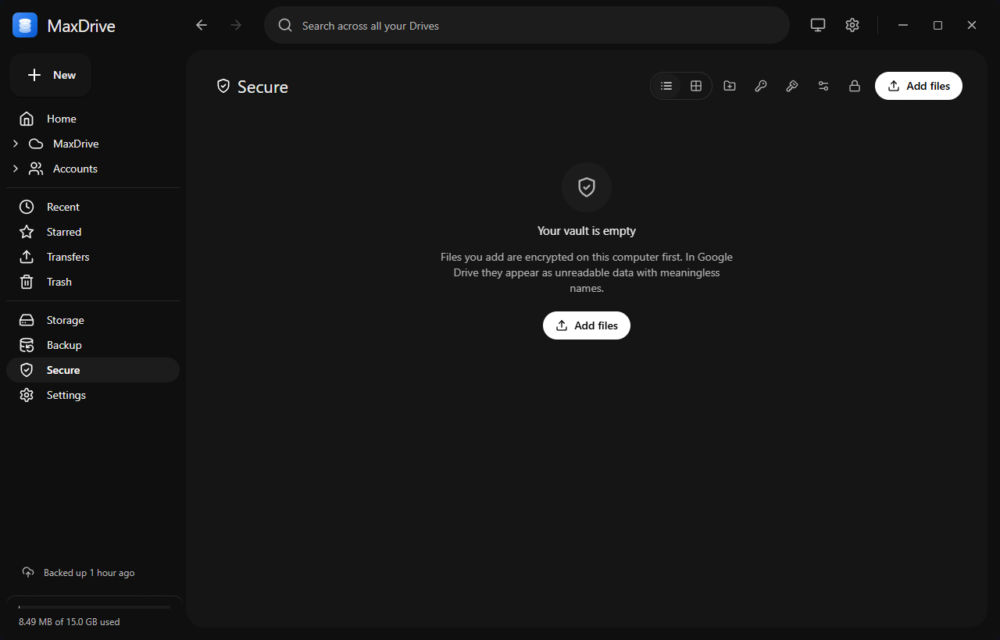

# Secure Storage (the vault)

Secure Storage is an end-to-end encrypted vault inside MaxDrive. Files you add are encrypted on your PC before anything is uploaded, so your Google Drive accounts only ever hold unreadable data with meaningless names.

The vault has its own page (**Secure** in the sidebar), its own master password and its own recovery key. It is separate from [vault mode](vault-mode.md), which encrypts your normal uploads.

## Before you start

- You need at least one connected **Google Drive** account. The vault cannot be stored on S3-compatible storage. See [Accounts and storage](accounts-and-storage.md).
- Pick a master password you will remember. There is no password reset.

## Create your vault

1. Open **Secure** from the sidebar.
2. On **Create your vault**, type a **Master password** (at least 8 characters). A meter shows Weak, Fair or Strong as guidance.
3. Type it again under **Confirm password** and click **Create vault**.
4. **Save your recovery key** appears. Click **Save to file** to write it to a `.txt` file, or **Copy** to put it on the clipboard.
5. Click **I've saved it - open my vault**. This button stays disabled until you have saved or copied the key.

MaxDrive puts the vault on the connected Google Drive account with the most free space. You can change this later (see [Choose where the vault is stored](#choose-where-the-vault-is-stored)).

> **Warning:** The recovery key is shown once and cannot be retrieved later. It is the only way into the vault if you forget the master password. Anyone who has it can open your secure files, so keep it somewhere offline - not in a folder you back up, and not in your Drive.

## Unlock and lock

**To unlock**, open **Secure**, enter your master password on **Your vault is locked** and click **Unlock**.

If you forgot the password, click **I forgot my password - use recovery key** and enter the recovery key. Case, spaces and dashes don't matter, and `0`/`O` and `1`/`I` mix-ups are corrected. After unlocking this way, MaxDrive opens **Change master password** so you can set a new one.

**To lock**, do any of the following:

- Click the **Lock vault** button on the Secure page.
- Run **Lock the vault** from the command palette (only listed while the vault is unlocked).
- Quit MaxDrive. The key is wiped from memory on exit.
- Let it auto-lock after a period of inactivity.

**Auto-lock** is set in **Vault storage** (the gear button on the Secure page) under **Lock the vault automatically**:

| Option                       | Behaviour                         |
| ---------------------------- | --------------------------------- |
| After 2 minutes idle         | Locks after 2 minutes             |
| After 10 minutes idle        | Default                           |
| After 30 minutes idle        | Locks after 30 minutes            |
| Only when I quit MaxDrive    | Never locks on idle               |

**Too many wrong attempts.** The first 5 failed attempts are free. After that, each failure adds a delay (2 s, 4 s, 8 s and so on, up to 5 minutes). The Unlock button shows a countdown (**Try again in Ns**). The counter survives restarting the app.

## Add files

1. Unlock the vault.
2. Click **Add files** and pick files, or drag files and folders onto the Secure page (**Drop to encrypt into your vault**).

Each file is encrypted on this PC first, then the encrypted copy is uploaded. Dropped folders keep their structure inside the vault. Vault uploads and downloads never appear on the Transfers page or in the transfer tray, because their names would give away what is in the vault.

## Browse, preview and download

While unlocked, the vault works like a small file browser:

- Switch between list and grid views. Image thumbnails are kept encrypted on this PC and decrypted only for display.
- Use **New folder** to organise files. Click the **Secure** title or a breadcrumb to go back up.
- Right-click an item for **Preview**, **Download**, **Rename**, **Details** and **Delete**.
- **Preview** works for images, video, audio, PDFs and text. Content is decrypted in memory, and seeking in a video fetches only the parts it needs. Nothing decrypted is written to disk.
- **Download** asks for a folder, then fetches the encrypted file, checks it and decrypts it there.
- **Details** shows size, encrypted size, dates, the encryption used and which accounts hold a copy.

> **Note:** **Delete** in the vault is immediate and permanent. It erases the encrypted copies from every account holding them. There is no vault trash.

## Change your password or recovery key

**Change master password** (key button on the Secure page): enter your current password, or switch to **I forgot my password - use recovery key**, then the new password twice. No files are re-encrypted or re-uploaded, and your existing recovery key keeps working.

**New recovery key**: confirm with your master password (or **Use my current recovery key instead**), then click **Generate key**. Save or copy the new key before closing. The previous recovery key stops working immediately. Use this if you think your recovery key has been exposed.

## Choose where the vault is stored

Click **Vault storage** (gear button) on the Secure page:

- **Accounts in use** lists each Google Drive account holding vault files, with its file count, copies in progress, free space and health. **Needs reconnecting** means the account must be reconnected on the Accounts page.
- **Add an account** lists other connected Google Drive accounts. Click one to extend the vault onto it.
- **Copies of each file** sets how many accounts hold each file:

| Setting   | Meaning                       |
| --------- | ----------------------------- |
| 1 copy    | Uses the least storage (default) |
| 2 copies  | Survives losing one account   |
| 3 copies  | Maximum redundancy            |

The setting applies to new files right away; existing files are adjusted in the background. Copies are made by moving ciphertext, so this keeps working while the vault is locked. If one account is offline, files with a copy elsewhere stay readable, and a periodic background check repairs missing copies when accounts come back.

## Remove a host account

1. In **Vault storage**, click **Remove** next to the account.
2. MaxDrive checks what is stored there. If some files have no other copy, it says how many and names some of them.
3. Choose one option:
   - **Move the files first (recommended)** copies everything to your other vault accounts, then drops this account automatically. Offered only when another account can take the files.
   - **Remove it right now** takes effect immediately. Files with no other copy stop being readable until you add the account back. Tick **Also erase the encrypted files from that Drive** to delete them from that account as well.
4. Click **Move files, then remove** or **Remove now**.

## Restore your vault on a new PC

The vault's configuration and an encrypted index are stored next to the encrypted files in your Drive, so a reinstall needs nothing but your password or recovery key.

1. Install MaxDrive and connect the Google account(s) that held the vault.
2. Open **Secure**. Click **A vault already exists in your Drive - restore it instead**.
3. **Restore your vault** lists where it was found and how many files each account holds.
4. Enter the **Master password**, or click **Use my recovery key instead**, and click **Restore**.

Each encrypted file carries its own wrapped key, so files uploaded after the last index snapshot are recovered too. They appear as **Recovered** followed by a short ID, because their names were not in the snapshot.

## What is hidden and what isn't

| Who / where                       | Can see                                                                                                   | Cannot see                                      |
| --------------------------------- | --------------------------------------------------------------------------------------------------------- | ----------------------------------------------- |
| Someone with access to your Drive | A hidden `.vault` folder, the number of `<uuid>.mxv` files, their approximate sizes and upload times      | File names, types, folder names, contents       |
| Normal MaxDrive views             | Nothing - vault items never appear in Files, search, Recent, Starred or the folder tree                  | -                                               |
| This PC's database while locked   | Item sizes, dates and folder structure                                                                    | File and folder names, types                    |
| The Secure page while locked      | Only the unlock screen - no names, counts or thumbnails                                                   | Everything else                                 |

## If you lose both the password and the recovery key

Nothing can recover the vault. Not MaxDrive, not Google, not the developers. There is no back door, no reset and no stored copy of your key. The encrypted files stay in your Drive but can never be decrypted. This is what makes them private.

If you still have one of the two, act now: unlock and set a new password, or generate a new recovery key and store it safely.

## How the encryption works

- **Master key.** Creating the vault generates a random 256-bit master key. It is never stored as-is.
- **Password wrap.** Your password is stretched with scrypt (N = 2^15, r = 8, p = 1, random 32-byte salt) into a key-encryption key, which encrypts the master key with AES-256-GCM. No password hash is stored; a wrong password simply fails the GCM check.
- **Recovery wrap.** The recovery key is 32 random bytes, shown as base32 text. It wraps the same master key separately, the same way. That is why changing the password only re-wraps 32 bytes and never touches your files.
- **Files.** Each file gets its own random key, wrapped by the master key and stored in the file's 128-byte header. Content is split into 4 MiB chunks, each encrypted with AES-256-GCM. The nonce is a per-file random prefix plus the chunk number, so chunks cannot be reordered or swapped between files without failing. The result is a self-describing `.mxv` file.
- **Integrity.** MaxDrive checks the upload against Drive's MD5 checksum, authenticates every chunk on download and checks the whole file against its SHA-256 hash. Tampering fails loudly.
- **Metadata.** File names and types are encrypted with AES-256-GCM under the master key, both in the local database and in the index snapshot uploaded to Drive.
- **Keys stay in one place.** The unlocked master key lives only in MaxDrive's background process memory and is zero-filled when the vault locks. The app's window receives decrypted results, never keys.
